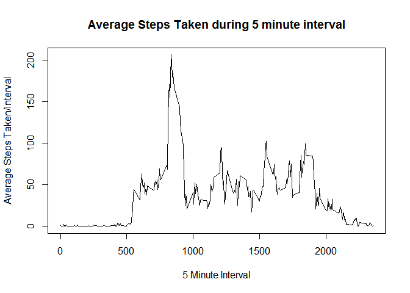

# Reproducible Research: Peer Assessment 1

## Use these libraries

```r
library(knitr)
library(dplyr)
```


## Loading and preprocessing the data

```r
unzip("activity.zip")
raw_activity <- read.csv("activity.csv")

# remove missing data and turn date column into date type
activity <- na.omit(raw_activity)
activity$date <- as.Date(activity$date)

kable(summary(raw_activity))
```

         steps                date          interval    
---  ---------------  -----------------  ---------------
     Min.   :  0.00   2012-10-01:  288   Min.   :   0.0 
     1st Qu.:  0.00   2012-10-02:  288   1st Qu.: 588.8 
     Median :  0.00   2012-10-03:  288   Median :1177.5 
     Mean   : 37.38   2012-10-04:  288   Mean   :1177.5 
     3rd Qu.: 12.00   2012-10-05:  288   3rd Qu.:1766.2 
     Max.   :806.00   2012-10-06:  288   Max.   :2355.0 
     NA's   :2304     (Other)   :15840   NA             


## What is mean total number of steps taken per day?

```r
activity_by_day <- group_by(activity, date)
steps_by_day <- summarise(activity_by_day, total=sum(steps))

meansteps <- mean(steps_by_day$total)
mediansteps <- median(steps_by_day$total)
```

The mean number of steps per day is 10766.19, and the median number of steps per day is 10765.


## What is the average daily activity pattern?

```r
activity_by_interval <- group_by(activity, interval)
mean_steps_by_interval <- summarise(activity_by_interval, meansteps=mean(steps))

interval_with_max_steps <- mean_steps_by_interval$interval[which.max(mean_steps_by_interval$meansteps)]

plot(mean_steps_by_interval$interval, mean_steps_by_interval$meansteps, 
     type="l",
     xlab="5 Minute Interval",
     ylab="Average Steps Taken/Interval",
     main="Average Steps Taken during 5 minute interval")
```

<!-- -->

The maximum number of steps occurred during 5-minute interval 835.

## Imputing missing values


```r
missing_count <- sum(is.na(raw_activity$steps))
```

There are 2304 missing values in the dataset.


## Are there differences in activity patterns between weekdays and weekends?
