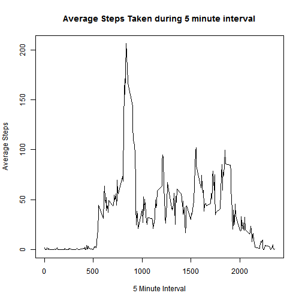

## Use these libraries

```r
library(knitr)
library(dplyr)
library(ggplot2)
```


## Loading and preprocessing the data

```r
unzip("activity.zip")
raw_activity <- read.csv("activity.csv")

# remove missing data and turn date column into date type
activity <- na.omit(raw_activity)
activity$date <- as.Date(activity$date)

# show a summary of the data
kable(summary(raw_activity))
```


|   |    steps      |        date     |   interval    |
|:--|:--------------|:----------------|:--------------|
|   |Min.   :  0.00 |2012-10-01:  288 |Min.   :   0.0 |
|   |1st Qu.:  0.00 |2012-10-02:  288 |1st Qu.: 588.8 |
|   |Median :  0.00 |2012-10-03:  288 |Median :1177.5 |
|   |Mean   : 37.38 |2012-10-04:  288 |Mean   :1177.5 |
|   |3rd Qu.: 12.00 |2012-10-05:  288 |3rd Qu.:1766.2 |
|   |Max.   :806.00 |2012-10-06:  288 |Max.   :2355.0 |
|   |NA's   :2304   |(Other)   :15840 |NA             |


## What is mean total number of steps taken per day?

```r
# group by day and add total steps per day
steps_by_day <- activity %>%
            group_by(date) %>%
            summarise(total=sum(steps))
```


```r
# calculate mean and median total steps per day
meansteps <- mean(steps_by_day$total)
mediansteps <- median(steps_by_day$total)
```

The mean number of steps per day is **10766.19**, and the median number of steps per day is **10765**.


## What is the average daily activity pattern?

```r
#group by interval and add mean steps per interval
mean_steps_by_interval <- activity %>%
            group_by(interval) %>%
            summarise(meansteps=mean(steps))


# plot average steps by interval
plot(mean_steps_by_interval$interval, mean_steps_by_interval$meansteps, 
     type="l",
     xlab="5 Minute Interval",
     ylab="Average Steps",
     main="Average Steps Taken during 5 minute interval")
```




```r
# find interval with max steps
interval_with_max_steps <- mean_steps_by_interval$interval[which.max(mean_steps_by_interval$meansteps)]
```

The maximum number of steps occurred during 5-minute interval **835.**

## Imputing missing values


```r
# count missing values
missing_count <- sum(is.na(raw_activity$steps))
```

There are **2304** missing values in the dataset.

Let's replace the NAs with the mean step count for that interval.


```r
# prepare data set with imputed steps grouped by day

# function to return mean steps for an interval if steps are missing
imputeMissingValue <- function(steps, interval) {
  imputedSteps <- NA
  if (!is.na(steps))
    imputedSteps <- steps
  else 
    imputedSteps <- mean_steps_by_interval[mean_steps_by_interval$interval == interval, "meansteps"]
}

# turn raw data into new data frame with imputed steps, using the function above
imputed_data <- raw_activity
imputed_data$imputed_steps <- as.numeric(mapply(imputeMissingValue, imputed_data$steps, imputed_data$interval))
imputed_data$date <- as.Date(imputed_data$date)

# group by date and add total imputed steps
total_imputed_steps_per_day <- imputed_data %>%
          group_by(date) %>%
          summarise(totalsteps=sum(imputed_steps))
```

Let's plot the total steps per day


```r
# plot total steps per day using imputed data
hist(total_imputed_steps_per_day$totalsteps, 
     xlab="Total # steps/day", 
     ylab="Count", 
     main="Total # steps taken each day",
     col=3)
```


```r
# calculated mean and median total imputed steps per day
imputed_mean_steps <- mean(total_imputed_steps_per_day$totalsteps)
imputed_median_steps <- median(total_imputed_steps_per_day$totalsteps)
```

The mean number of steps per day is **10766.19**, and the median number of steps per day is **10766.19**.

## Are there differences in activity patterns between weekdays and weekends?

Let's add a new column showing the day type, ie weekday or weekend. We can then plot a summary of mean steps/interval for both weekdays and weekends.


```r
# Add a column denoting day type, ie weekday or weekend:
imputed_data$day <- weekdays(imputed_data$date)
weekend_days <- c("Saturday", "Sunday")
imputed_with_day_type <- mutate(imputed_data, daytype=factor(case_when(day %in% weekend_days ~ "weekend", TRUE ~ "weekday")))
```


```r
# Group by interval and add mean step count for each interval:
average_by_day_type <- imputed_with_day_type %>%
    group_by(daytype, interval) %>%
    summarise(meansteps=mean(imputed_steps))
```


```r
# Plot average number of steps taken in weekends and weekdays:
qplot(interval, meansteps, data=average_by_day_type,
      geom="line",
      xlab="5 Minute Interval",
      ylab="Average Steps",
      facets =daytype ~ .) + ggtitle("Average steps taken on Weekends vs. Weekdays") + 
  theme(plot.title = element_text(hjust = 0.5))
```


Activity starts earlier on weekdays, which suggests going to work. The average stays at a higher level during the day on weekends, which suggests less sedentary activities, maybe including sport. 
